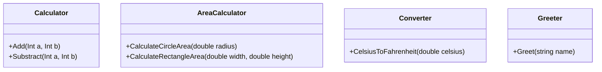

```mermaid
classDiagram
class Calculator{
+Add(Int a, Int b)
+Substract(Int a, Int b)
}
class AreaCalculator{
 +CalculateCircleArea(double radius)
 +CalculateRectangleArea(double width, double height)
}
class Converter{
 +CelsiusToFahrenheit(double celsius)
}
class Greeter{
 +Greet(string name)
}
```
